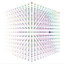

#  About Me:
<table>
  <tr>
    <td width="50%">
      
    </td>
    <td width="50%">
      <h1>About Me:</h1>
      
🔭 I'm currently working as a Full Stack Developer

      
🌱 I'm currently learning Azure, AWS, DevOps

      
💬 Ask me about Movies

    </td>
  </tr>
</table>

## 🌐 Socials:
 

# 💻 Tech Stack:
             
# 📊 GitHub Stats:

 

---

<!-- Proudly created with GPRM ( https://gprm.itsvg.in ) -->
